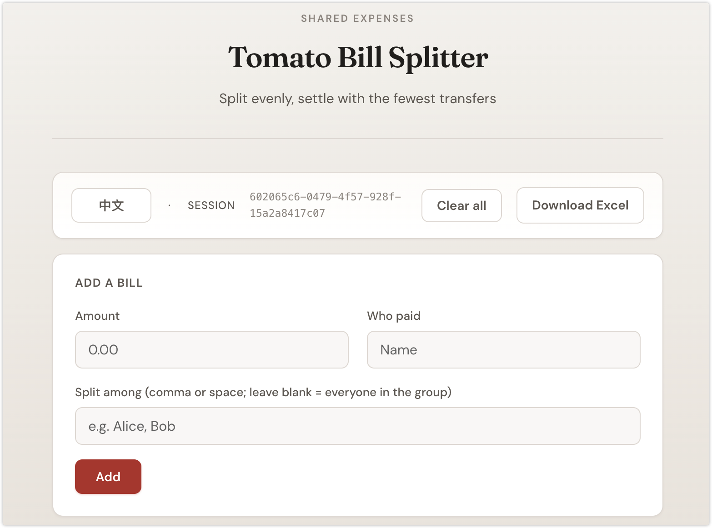
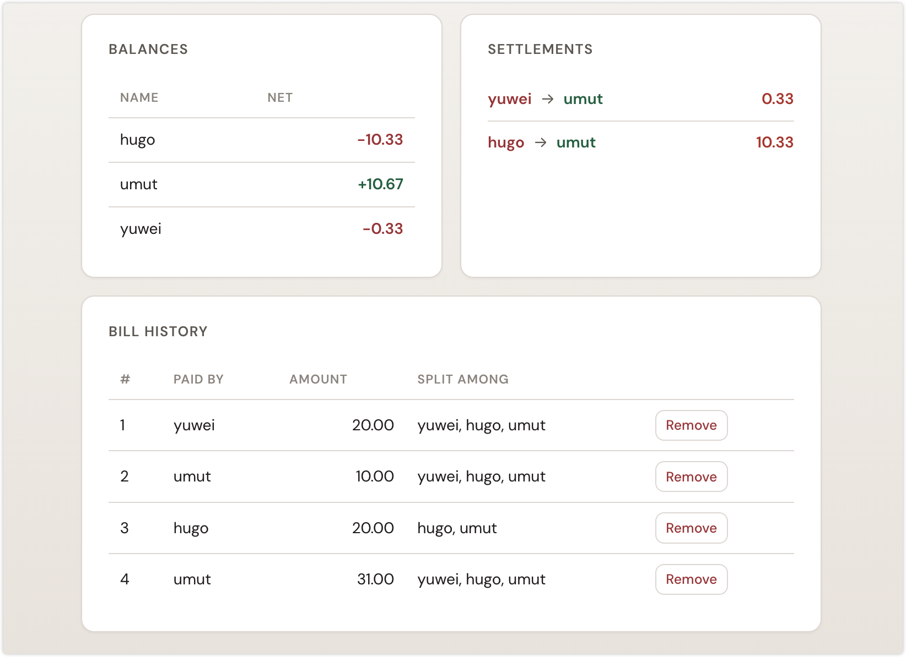

# Tomato Bill Splitter

A small **interactive terminal app** for splitting shared expenses in a group. When one person pays for something that benefits several people, you record who paid, how much, and who should share the cost. The tool tracks everyone’s net balance and, when you’re done, suggests **minimal person-to-person payments** so the group can settle up without unnecessary transfers.

## What it’s for

Use it after meals, trips, or housemates’ shared bills: enter each expense as you go (or in one sitting), then use **Settle up** to see who should pay whom and how much so nobody is left covering others unfairly.

## Requirements

- Python 3.10+ (recommended)
- Dependencies listed in `requirements.txt` ([Rich](https://github.com/Textualize/rich) for the CLI, [FastAPI](https://fastapi.tiangolo.com/) + [Uvicorn](https://www.uvicorn.org/) for the optional web UI, [openpyxl](https://openpyxl.readthedocs.io/) for Excel export)

## Installation

From the project directory:

```bash
python3 -m venv .venv
source .venv/bin/activate   # On Windows: .venv\Scripts\activate
pip install -r requirements.txt
```

## How to run

**Terminal (CLI):**

```bash
python split_bill.py
```

You’ll see a menu-driven interface in the terminal.

**Web UI (browser):**

```bash
uvicorn web_server:app --reload --host 127.0.0.1 --port 8000
```

Open [http://127.0.0.1:8000](http://127.0.0.1:8000). The page stores a session id in `localStorage`; use **清空重来** to clear bills for that session. **下载 Excel** uses the same spreadsheet format as CLI option **5**.

### Web UI sample
**1.** Add a bill (amount, payer, split list) and view **Balances**.



**2.** Review **Settlements** (who pays whom) and the **Bill history** table.



## How to use

| Option | What it does |
|--------|----------------|
| **1 — Add a bill** | Enter the **amount**, **who paid**, and **who consumed** (split **evenly** among consumers). If you leave consumers blank and press Enter, everyone in the current group is included. You can type names separated by spaces or commas. New names are remembered for later bills. |
| **2 — View balances** | Shows each person’s net balance: positive means they’re owed money overall; negative means they owe. |
| **3 — View bill history** | Lists all recorded bills with ID, payer, amount, and participants. |
| **4 — Delete a bill** | Removes a bill by its **#** from history and recalculates balances (useful if you mistyped an entry). |
| **5 — Settle up & exit** | Shows bill history (if any), then prints suggested transfers: *debtor → creditor : amount* so you can settle with the fewest payments. Then the program exits. |

### Tips

- **Even splits only**: each bill’s total is divided equally across everyone listed as a consumer (including the payer if they’re in that list).
- **Ctrl+C** can interrupt a prompt (e.g. while entering a bill); you’ll return to the main menu when safe.
- After option **5**, run `python split_bill.py` again if you need another session.

